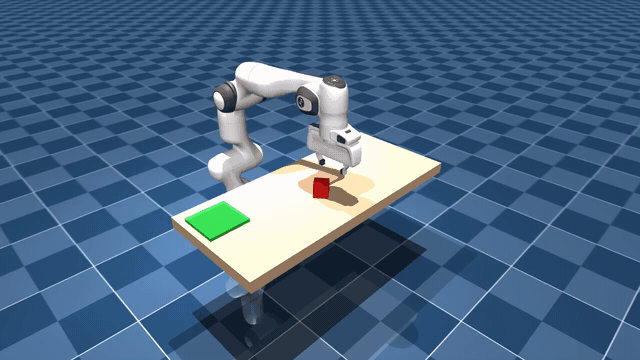

# MuJoCo Panda Pick-and-Place

A scripted pick-and-place pipeline for the Franka Panda arm built from scratch on
MuJoCo: a damped least-squares inverse kinematics solver, a finite-state-machine
policy, and a reproducible evaluation harness that reports quantitative success
rates. **No learned policy, no copied demo — every layer of the controller is
hand-written and fully inspectable.**

Result: **100 % grasp and 100 % place success over 50 episodes** on two
independent random seeds (see [Results](#results)).



> Generate a demo video with `python run_eval.py --record 3`
> (writes `results/eval_video.mp4`).

## Task

A 5 cm cube is spawned at a uniformly random position on a table
(x ∈ [0.38, 0.58] m, y ∈ [-0.24, 0.24] m) with a uniformly random yaw. The Panda
must:

1. **Grasp** it with a top-down parallel-jaw grip, and
2. **Place** it on a target pad 0.5 m away at `(0.42, -0.36)`.

Success criteria are deliberately strict (following the
[leap-dexterous-grasping](https://github.com/flyingGH/leap-dexterous-grasping)
convention):

| Criterion | Definition |
|---|---|
| `grasp_success` | cube lifted **> 5 cm** above the table surface and kept there for **20 consecutive control steps** (rejects momentary lifts) |
| `place_success` | at episode end the cube is at rest (**speed < 5 cm/s**) within **6.5 cm** (XY) of the pad center |

## Results

Batch evaluation, 50 episodes per seed, fixed RNG seeds, headless:

| Seed | Episodes | Grasp success | Place success | Avg steps (placed) | Failures |
|---|---|---|---|---|---|
| 42 | 50 | **100 %** | **100 %** | 1347.5 (13.5 s) | — |
| 0  | 50 | **100 %** | **100 %** | 1304.7 (13.0 s) | — |

Per-episode details (steps, max lift, failure class) are stored in
`results/success_rate.json` and `results/success_rate_seed0.json`.

- Simulation: **500 Hz** (`timestep = 2 ms`), control: **100 Hz** (decimation 5)
- Time limit: 1800 control steps per episode (18 s)
- Wall time: ≈ 65 s for 50 episodes (single CPU core, no GPU needed)

## Method

```
            ┌──────────────────────────  policy (FSM)  ──────────────────────────┐
 cube pose  │  HOVER → DESCEND → CLOSE → LIFT → TRANSIT → LOWER → RELEASE →      │
 TCP error  │                                        RETRACT → DONE              │
            └───────────────┬────────────────────────────────────────────────────┘
                            │ Cartesian TCP target + gripper command
                    ┌───────▼────────┐
                    │  TCP ref ramp  │  0.18 m/s slew-rate limit (smooths state
                    └───────┬────────┘  transitions, avoids shaking off the load)
                    ┌───────▼────────┐
                    │  DLS IK solver │  resolved-rate, per-step dq,
                    │                │  point Jacobian + nullspace bias
                    └───────┬────────┘
                    ┌───────▼────────┐
                    │ MuJoCo physics │  7 position servos + tendon gripper
                    └────────────────┘
```

### Finite-state machine ([controller/state_machine.py](controller/state_machine.py))

Each state emits a Cartesian target + gripper command and advances when the
position/orientation error stays below tolerance for 3 consecutive steps
(500-step per-state timeout as fallback):

| State | Action | Exit condition |
|---|---|---|
| `HOVER` | track point 12 cm above the cube, jaws open | converged |
| `DESCEND` | vertical descent to cube center height | converged |
| `CLOSE` | close jaws (≈1.1 N/finger), stall-detect grip width | width stable for 0.1 s + 0.3 s squeeze |
| `LIFT` | vertical lift 20 cm | converged |
| `TRANSIT` | carry to 15 cm above the pad | converged |
| `LOWER` | descend to **6 cm** above the pad (low drop → no bounce-out) | converged |
| `RELEASE` | open jaws | 0.4 s |
| `RETRACT` | retreat | converged → `DONE` |

Key design decisions:

- **Yaw-aligned face grasp.** The gripper opening is rotated to be exactly
  parallel to one pair of cube faces (relative yaw folded to ±45°, joint 7 has
  plenty of travel). With random cube yaw this is *essential*: an unaligned
  grasp lands on the cube's diagonal (jaw gap 0.067 m instead of 0.050 m), and
  the edge-contact friction cone cannot hold the cube through the transit — it
  slips mid-air. After alignment every grasp is a stable full-face grip
  (gap ≡ 0.050 m throughout carry).
- **Grip force auto-centers the cube.** The hold command (ctrl = 24 on the
  tendon drive) produces ≈1.06 N per finger — slightly above cube–table friction
  (~1 N), so closing pushes the cube to the jaw midpoint. A gentler "touch"
  command (0.14 N) measurably fails to do this and yields one-sided pseudo-grasps.
- **Low release.** Dropping from 15 cm makes the cube bounce out of the 6.5 cm
  pad tolerance; releasing at 6 cm eliminated that failure mode entirely.
- **Convergence semantics.** Convergence is measured TCP→commanded-goal, not
  TCP→ramped-reference; otherwise the slew-rate ramp makes every state look
  instantly converged.

### Inverse kinematics ([controller/ik_solver.py](controller/ik_solver.py))

Resolved-rate damped least squares running at 100 Hz against the menagerie
position servos:

- Point Jacobian for the TCP (mid-fingertip point, 0.103 m below the hand
  flange) computed from the body Jacobian via `J_p = J_o - skew(r) J_o`;
  the menagerie XML defines no site there.
- Orientation error as a world-frame axis-angle: `q_err = q_tgt ⊗ conj(q_cur)`.
- Damping 0.08, per-step joint increment clipping (0.03 rad), nullspace bias to
  the home grasp pose, joint-limit clamping.
- A command-space velocity damping term (`-k·qvel`) cancels servo-lag overshoot.

### Gripper ([controller/gripper.py](controller/gripper.py))

Thin wrapper around the tendon-driven `actuator8` (split tendon, 0.5/0.5), with
the force map calibrated from the tendon model
(`F = 0.0157·ctrl − 100·q − 10·q̇`): ctrl 255 = open, ctrl 24 = hold
(~1.1 N/finger), plus stall detection and a `width_m` gap readout used by the
FSM's grasp confirmation.

## Failure analysis

`eval/diagnose.py` classifies every failed episode into an actionable taxonomy:

| Class | Meaning |
|---|---|
| `NOT_REACHED` | TCP never got within 5 cm of the cube |
| `GRASP_FAILED` | contact happened but no stable grip was established |
| `SLIPPED` | cube was lifted ≥ 5 cm but dropped before release |
| `MISSED_BIN` | grasp succeeded, cube not at rest inside the pad tolerance |
| `KNOCKED_OFF_TABLE` | cube knocked off the table edge |

The controller currently achieves a clean sweep, but the harness keeps the
diagnostic trail of every earlier failure mode. Bugs that were found, root-caused
and fixed during development (all verified by targeted probing scripts):

1. **Mirror-image yaw alignment** — reading the cube yaw from `xmat[1]`
   (row-major `R[0][1]`, not `R[1][0]`) returns *−yaw*, silently turning every
   aligned grasp into a 45° diagonal grasp that slipped mid-transit. This was the
   dominant failure (18 % of episodes) and was proven by a jaw-angle sweep:
   width 0.067 m ⇒ edge contact, 0.050 m ⇒ face contact.
2. **Ramp-induced false convergence** — the slew-rate reference made IK error
   always read < 5 mm, so the FSM skipped states and closed its jaws in mid-air.
3. **One-sided pseudo-grasp** — a 0.14 N "touch" close command cannot overcome
   table friction, so one jaw stalled while the other never touched the cube.
4. **High-drop bounce-out** — releasing 15 cm above the pad bounced the cube
   outside the placement tolerance (18 % of episodes before the `LOWER` state).

## Getting started

Requires Python 3.10+ (developed on 3.11, Windows/Linux).

```bash
git clone <this-repo> mujoco-panda-pick-place
cd mujoco-panda-pick-place
pip install -r requirements.txt

# one-command evaluation: 50 episodes, seed 42, writes results/success_rate.json
python run_eval.py
```

Useful variants:

```bash
python run_eval.py --episodes 100 --seed 0        # longer run, different seed
python run_eval.py --viewer                       # watch live in MuJoCo viewer
python run_eval.py --record 3                     # save first 3 episodes as results/eval_video.mp4
python run_eval.py --episodes 1 --debug           # per-25-step state log
```

All CLI options: `python run_eval.py --help`.

## Repository layout

```
├── run_eval.py                  # CLI entry point (evaluate / view / record)
├── requirements.txt
├── controller/
│   ├── ik_solver.py             # damped least-squares IK (point Jacobian, nullspace bias)
│   ├── state_machine.py         # pick-and-place FSM policy
│   └── gripper.py               # tendon gripper wrapper (calibrated force map)
├── env/
│   └── grasp_env.py             # Gymnasium-style env: 100 Hz control / 500 Hz sim,
│                                # strict success flags, obs/info/reward
├── eval/
│   ├── evaluate.py              # batch runner + JSON aggregation
│   └── diagnose.py              # failure taxonomy
├── franka_emika_panda/          # MuJoCo Menagerie Panda (vendored, see its LICENSE)
│   ├── grasp_scene.xml          # table + freejoint cube + target pad + eval camera
│   ├── panda.xml / scene.xml    # stock menagerie models
│   └── assets/                  # meshes
└── results/
    ├── success_rate.json        # seed 42: 100 % / 100 %
    └── success_rate_seed0.json  # seed 0:  100 % / 100 %
```

## Reproducibility

Every episode is driven by `seed + episode_index` through a dedicated
`numpy.random.Generator`; physics is fully deterministic (no warm-up noise, no
domain randomization). Running

```bash
python run_eval.py --episodes 50 --seed 42
```

reproduces the exact table above step-for-step on any platform.

## References

- Robot model: [MuJoCo Menagerie — Franka Emika Panda](https://github.com/google-deepmind/mujoco_menagerie)
  (vendored unmodified; its BSD-style license applies to `franka_emika_panda/`)
- Success-criteria convention: [leap-dexterous-grasping](https://github.com/flyingGH/leap-dexterous-grasping)
- Related benchmarks: [DexGraspBench](https://github.com/flyingGH/DexGraspBench),
  [panda_mujoco_gym](https://github.com/zichunxx/panda_mujoco_gym)
